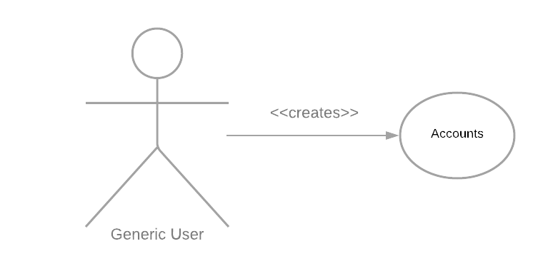
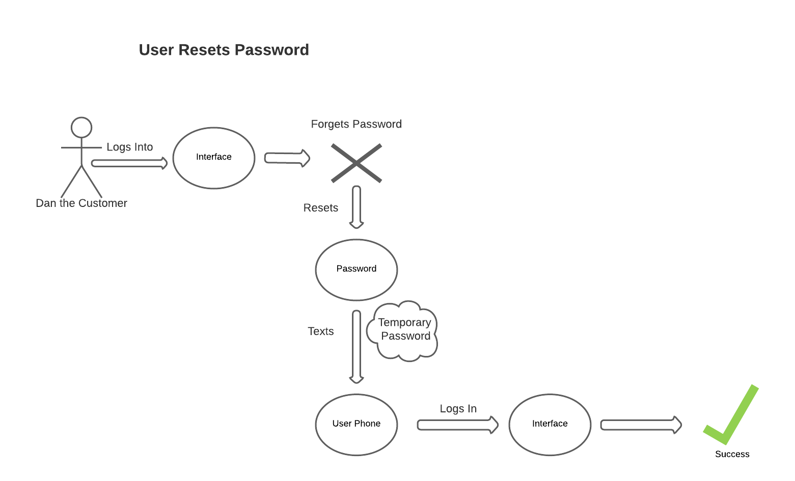
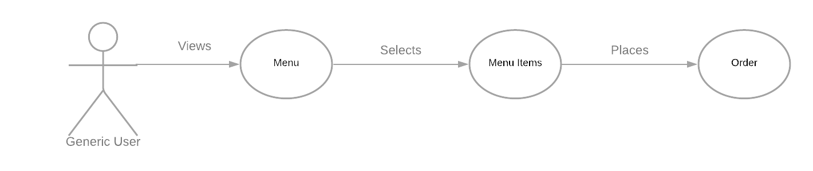
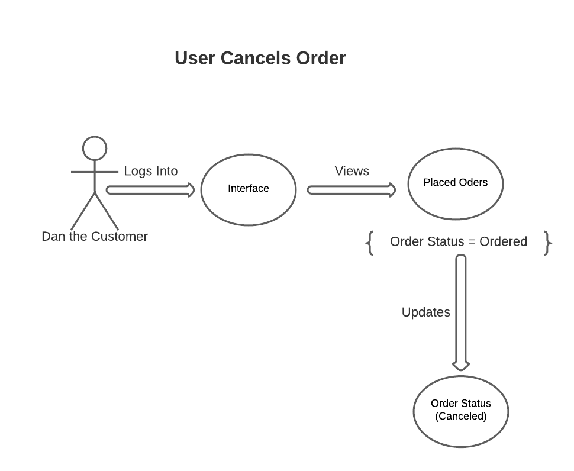
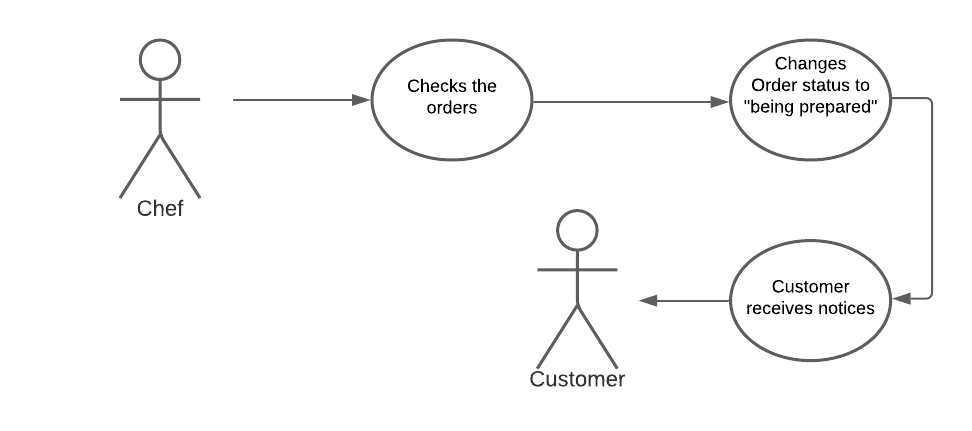
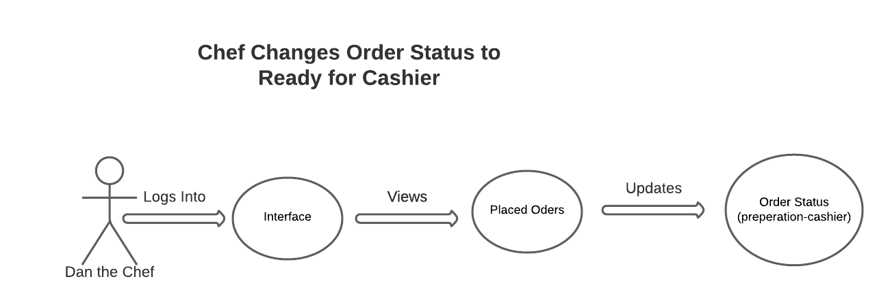
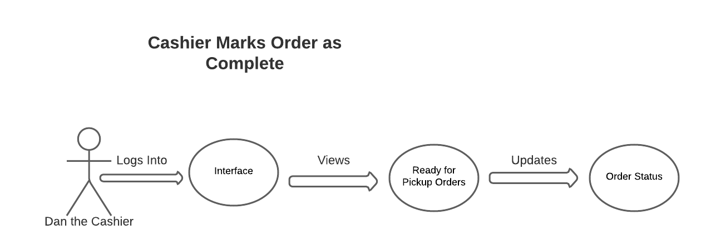
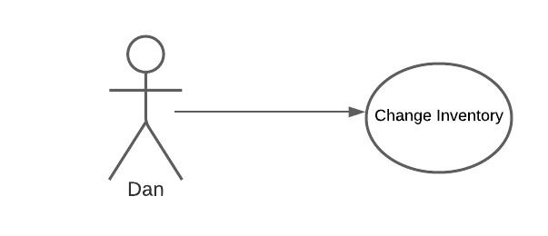

# Requirements Definition

## Introduction

This document provides the detailed project requirements and use cases for the Dan's Bagel Shop project. Dan, the owner of Dan's Bagel Shop, has contracted with The Rat Clan to develop an interactive web app. Dan has given the project team a list of requirements and also optional features to implement if time provides. Customers will use the app to place orders and view the orders' status, and Dan's team will be able to view and manage the orders. The project will be delivered on December 5th for final review and approval prior to the shop's opening for business. 

Dan requires that his future potential customers will be able to use the web app to order any of the bagel products offered by the shop in a easy, straightforward way. Any friction the customers encounter could have massive negative implications if customers abandon the ordering and checkout process. As this website is business's only point of sale, there will be significant amount of time spent on user experience optimization. After placing an order, customers will view its preparation status and be alerted when it's ready to be picked up. Each order can have one of the following statuses:

* Ordered
* Preparation (Chef)
* Preparation (Cashier)
* Ready for Pickup      
* Completed
* Canceled

Employees of Dan's Bagel Shop will use an internal part of the system to view the status of all open orders, track inventory levels, and view various sales reports. A roles based access control system will ensure that employees can only work with the digital tools relevant to their job. The different roles include:

* **Owner** - Update inventory, view sales reports, and access all tools available to other employees
* **Chef** - View new orders and see which bagels and sandwich toppings are needed
* **Cashier** - View orders the chef has completed and see which spread and drinks are needed

## Users' Goals

| User | Goals |
| ---- | ----- |
| Owner | Owner needs to be able to update inventory in the store and manage account privileges for employees. |
| Chef | Chefs need to see new orders for sandwiches to make and pass them off to the cashier when finished. |
| Cashier | Cashiers put spread on bagels and get drinks for customers to pick-up. |
| Customer | Customers need to place an order for a bagel from anywhere and know when to arrive at the store to pick up their order |

#### User Creates an Account

 
  

#### User Resets Account Password

 
  

#### User Creates an Order

 
  

#### User Cancels and Order

 
  

#### Chef Starts Order Preparation

 
  

#### Chef Sends Order to Cashier

 
  

#### Cashier Finishes an Order

 
  

#### Owner Changes Shop Inventory

 
  

## Functional Requirements

1. **User Accounts**
    1. Anyone can create a new user account
        1. To create an account, new users must provide a name, email, phone number, and password
        2. New users are prevented from creating a new account using an email address already assigned to another account
        3. New user accounts are automatically given only the Customer role
        4. New user accounts are initialized with 100 Bagel Bucks
    2. Users must authenticate using email address and password to login
        1. If a corresponding email and password are entered, the user is given access to portions of the web app according to their assigned roles
        2. If a corresponding email and password are not entered, the user is able to try again
    3. Users can reset their password using email
        1. Users can enter an email and request to have a randomly generated new password sent to their email address 
        2. User is notified if they enter an email that does not correspond to any user account
2. **Profile Management & Access Controls**
    1. Authenticated users can modify their own name, email, phone number, and password
        1. Users can authenticate themselves to view their account information: name, email, phone, & password
        2. Name, email, and phone are displayed as plaintext, while the password is displayed as asterisks
        3. Users can click on any of their information to change it, then press a save button to commit the changes. 
        4. Pressing a cancel button discards changes
        5. Users are prevented from changing their email to one that already exists on another account
    2. Users with the Owner role can assign roles to existing accounts
        1. If an authenticated user has the 'owner' role on their account, they can view a list of all users
        2. Owner can search the list of users by name, email, or phone number
        3. Owner can add or remove roles from a user account (owner, chef, cashier, customer)
3. **Customer Features**
    1. Customers can check account balance and rewards info
        1. After authenticating, customers can view account balance and rewards info
        2. Customers can view the amount of remaining Bagel Bucks in their account
        3. Customers can view their amount of accumulated bagel points
    2. Customers can place orders
        1. Customer can select items to order individually
        2. Selected sandwich toppings and spread are associated with a bagel they will be put on
        3. Customer can select one of their previous orders to quickly re-order
        4. Customer confirms the number of Bagel Bucks their order costs before submitting
        5. Bagel Bucks account is deducted the price of the order when the order status changes from Ordered to In Preparation 
    3. Customers may not order out-of-stock items
        1. Out-of stock items are greyed out and unselectable
        2. If an item becomes out-of-stock between when it is selected and when the order is placed, the order will not be submitted and the customer must change their order
    4. Customers are informed of the status of their open orders
        1. Customer can view the status of the order between the time it is submitted and when it is picked up
        2. Order status can be Ordered, Preparation (Chef), Preparation (Cashier), Ready for Pickup, Completed, or Canceled
    5. Customers may cancel orders
        1. Customer may cancel orders while they have status of Ordered (before preparation begins)
        2. Canceled orders are set to status of Canceled
4. **Chef Features**
    1. User must authenticate to view chef portal
        1. Once a user authenticates, they can view the chef portal if their account has the 'Chef' role
        2. Users without the 'Chef' role cannot view the chef portal
    2. Chefs can see open orders
        1. Chefs can view a list of all orders with Ordered status
        2. Chefs can change an order's status to Preparation (Chef) when they start preparation
        3. Chefs see a separate list of orders with status Preparation (Chef)
        4. Each order visible to a chef shows them all the sandwich toppings to put on a bagel
    3. Chefs can send orders to cashier
        1. Once toppings have been placed on a bagel, chef can change the order status to Preparation (Cashier)
    4. Chefs can deduct stock from inventory
        1. The bagels and sandwich toppings used to make an order are automatically deducted from inventory when the status is changed from Preparation (Chef) to Preparation (Cashier)
        2. Chefs can manually deduct stock from inventory to throw away expired items
5. **Cashier Features**
    1. User must authenticate to view cashier portal
        1. Once a user authenticates, they can view the cashier portal if their account has the 'Cashier' role
        2. Users without the 'Cashier' role cannot view the cashier portal
    2. Cashiers can see open orders
        1. Cashiers can view a list of orders with status Preparation (Cashier)
        2. Cashiers can change and order's status to Ready for Pickup
        3. Cashiers can see a separate list with order status Ready for Pickup
        4. Each order visible to a cashier shows them all spreads and drinks needed
    3. Cashiers can mark orders as complete
        1. Cashiers can change an order's status to Completed when the customer picks it up
    4. Cashiers can deduct stock from inventory
        1. Spread and drinks in an order are automatically deducted from inventory when an order's status changes from Preparation (Cashier) to Ready for Pickup
        2. Cashiers can manually deduct stock from inventory if a drink spontaneously explodes
6. **Owner Features**
    1. User must authenticate to view owner portal
        1. Once a user authenticates, they can view the owner portal if their account has the 'Owner' role
        2. Users without the 'Owner' role cannot view the owner portal
    2. Owner can edit inventory
        1. Owner can manually edit inventory of any item to any amount
        2. Owner can press a big button to set the inventory amount of any item to 100
        3. Owner can press a bigger button to set the inventory amount of all items to 100
        4. Owner can press the biggest button to summon a legion of cherubim bearing an endless supply of manna from heaven
    3. Owner can edit menu
        1. Owner can add items to the menu
        2. Owner can remove items from the menu
        3. Items must be categorized as either a bagel, spread, sandwich topping, or drink
    4. Owner can see reports
        1. The time period of a report can be between custom dates or preset values (past 7 days, past 30 days, past 365 days, ytd, month, week, etc.)
        2. Total gross sales
        3. Gross sales per item
        4. YoY sales report for total gross sales, gross sales per item, etc.

## Non-functional Requirements

1. Web application will be developed using the Django framework
2. Architecture should support easily adding additional items to the menu at a later time
3. Five users should be able to browse and place orders simultaneously

## Future Features

1. Passwords will be encrypted and never transmitted or stored as plaintext
2. Add a bagel chat so that customers can talk to each other while ordering
3. Implement ability for customers to leave reviews on the bagel shop page
4. View the bagels using augmented reality on the iPhone 
5. An in-store point of sale system to allow employees to place an order with the cashier
6. Ability for the online payment system to accept credit or debit cards

## Glossary

#### Authentication

Process used to prove the identity of an individual

#### Bagel

An unsweetened, dense donut

#### Bagel Chat

A method for customers to live chat with each other when shopping on the Dan's Bagels website

#### Encryption

Transforming plaintext into cyphertext using a one-way hashing algorithm

#### Sandwich

A bagel with sandwich toppings on it
