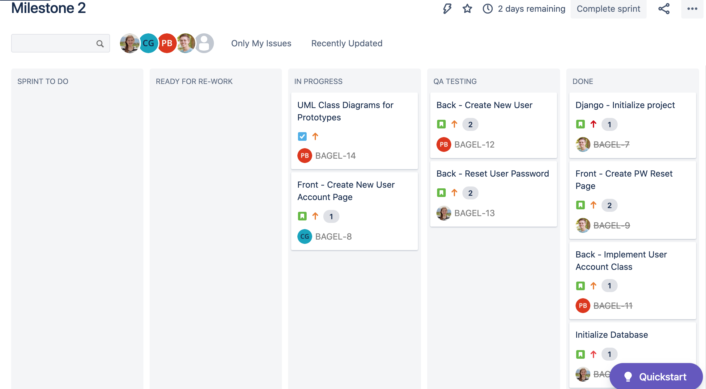
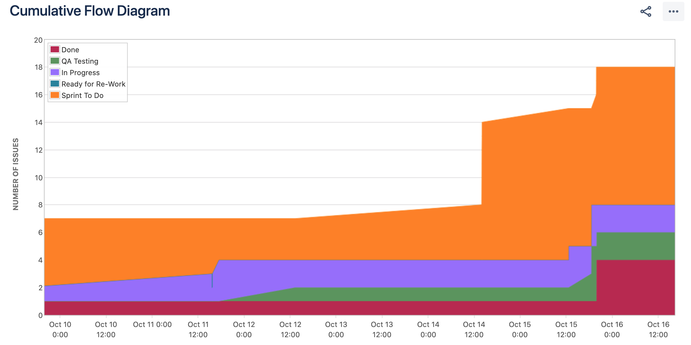
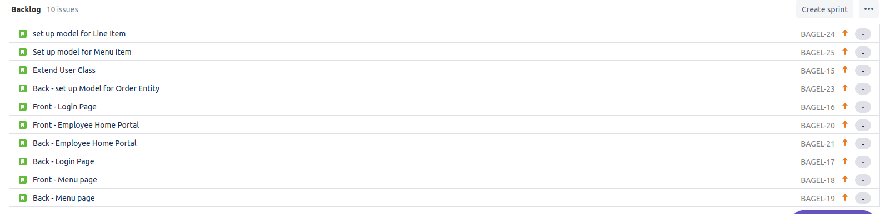

# Scrum Board History

## Jira Scrum Board
The columns indicate what state of development each of the issue are in (To-Do, In progress, Testing, Done). The pictures under each card indicate who they are assigned to. 

## Cumulative Flow
The chart below shows the cumulative flow of issue creation and progress

## Product Backlog
The listings below are items currently in our product backlog

